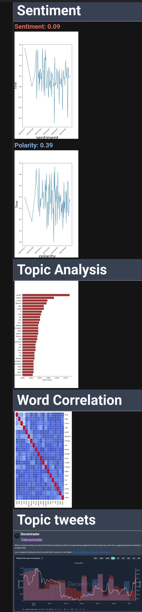

Tweet Analyser
========

`Tweet_analyser` is a Python library to generate a quick tweet report from a twitter list. The report will show the sentiment and polarity, the main topics and a correlation between the key words. It also will show the top n tweets and the most relevant tweets. Currently, the `Tweet_analyser` only runs in english. Support for other languages will be added.

# Setup
The tweet_report Python tool requires a proper configuration file in order to function correctly. The configuration file should include the following fields:

1. `API_KEY`: This field contain your Twitter API key.
2. `API_KEY_SECRET`: This field contain your Twitter API secret key.
3. `BEARER_TOKEN`: This field contain your Twitter API bearer token.
4. `ACCESS_TOKEN`: This field contain your Twitter API access token.
5. `ACCESS_SECRET`: This field contain your Twitter API access secret.
6. `CLIENT_SECRET`: This field contain your Twitter client secret.
7. `LIST_ID`: This field contain the ID number of the Twitter list that you want to analyze. You can find this ID number appended at the end of the list URL.
8. `SENDER_EMAIL`: This field contain the email address that you want to use to send the report.
9. `RECEIVER_EMAIL`: This field contain the email address that you want to receive the report. It can be the same as the sender email address.
10. `EMAIL_PASSWORD`: This field contain the password for the email address that you want to use to send the report.
11. `NTWEETS`: This field contain the number of tweets that you want to analyze. By default, the tool will analyze 1000 tweets.
12. `RUN`: This field should contain a boolean value to run the script. By default, the value is set to False.

You can create the file using the command `--create_config_file` or manually one by one using `set_parameter`.

Moreover, the package also relies on the `en_core_web_sm` model of spacy and `spacytextblob`, thus before running the model it is recomendable to run:

```bash
python -m spacy download en_core_web_sm
python -m textblob.download_corpora
```

You can see all the commands included in the tweeter_analyser tool using the command -h

```bash
Tweet_analyser [-h] [-s] [-set] [-sp] [-r] [-c] [-show] [-add] {} ...

Tweet analyser

positional arguments:
  {}

options:
  -h, --help            show this help message and exit
  -s, --start           Start the tweet analyser
  -set, --set_parameter
                        Set a parameter in the config file
  -sp, --stop           Stop the tweet analyser
  -r, --run             Run the tweet analyser
  -c, --create_config   Create a config file
  -show, --show_config  Show the config file
  -add, --add_boring_word
                        Add words to the ignore list
  -rm, --rm_boring_word 
                        Remove words from the boring list
```

# Run

Once the setting file is ready, you can run the tweeter report via `start` or `run`. Note that if the email associated with the bot is a Gmail, you'll need to enable less secure apps access for your Gmail account if you plan to use a Gmail account to send emails through this script. You can do this by following the instructions here: https://support.google.com/accounts/answer/6010255

The bot then will gather the data from the twitter lists and then send a report like the following:


# Special words

The tweeter analyser also includes the feature to filter out unnecesary words. You can add more words using the function -add 

```bash
Tweeter_analyser -add
```
